# KernelDLLInjection

<strong>날짜</strong>: 2024-03-14  
<strong>도구</strong>: Windbg, Visual Studio 2022, Virtual Box  
<strong>내용:</strong> Window Process 중 Kernel Section(Section 0)번은 PPL(Protected Process 
Light) 기술이 들어가 있어, OpenProcess로 프로세스가 열리지 않는다. 이 기능을 우회 시키기 위해 커널 디버깅을 이용하여 OpenProcess의 내부 구조를 파악한 뒤 Kernel Section Process의 핸들을 가져와서 Test.dll을 주입시킨다.

## 구조
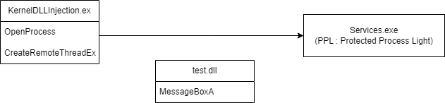

## 핵심 코드
```C++
if (mode == KERNEL) {
	HMODULE ntdll = NULL;
	void* originFuncAddr = NULL;

	ntdll = GetModuleHandle(L"ntdll");
	if (ntdll == NULL) {
		cerr << "ntdll" << endl;
		return FALSE;
	};
	
	originFuncAddr = GetProcAddress(ntdll, "NtCreateThreadEx");
	if (originFuncAddr == NULL) {
		cerr << "originFuncAddr" << endl;
		return FALSE;
	};

	//typedef NTSTATUS(*pNtCreateThreadEx)(
	//	_Out_ PHANDLE ThreadHandle,
	//	_In_ ACCESS_MASK DesiredAccess,
	//	_In_opt_ LPTHREAD_START_ROUTINE ObjectAttributes,
	//	_In_ HANDLE ProcessHandle,
	//	_In_ LPTHREAD_START_ROUTINE StartRoutine,
	//	_In_opt_ LPVOID Argument,
	//	_In_ BOOL CreateFlags, // THREAD_CREATE_FLAGS_*
	//	_In_ SIZE_T ZeroBits,
	//	_In_ SIZE_T StackSize,
	//	_In_ SIZE_T MaximumStackSize,
	//	_In_opt_ void* AttributeList
	//	);

	auto result = ((pNtCreateThreadEx)(originFuncAddr))(&this->remoteThreadHandle, 0x1FFFFF, NULL, this->processHandle, (LPTHREAD_START_ROUTINE)this->remoteThreadFunc, this->allocMemoryAddr, FALSE, NULL, NULL, NULL, NULL);
	if (result != 0) {
		cerr << "NtCreateThreadEx" << endl;
		return FALSE;
	};
```
Windows7 까지는 System Section Process 에 NtCreateThread를 이용하면 RemoteThreadEx 기능을 사용할 수 있었으나, Window10 기준 현재 PPL(Protected process Light)가 적용된 System Section Process 에서는 동작되지 않는다.


## 해결법
### OpenProcess & CreateRemoteThreadEx
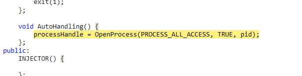

OpenPorcess의 경우도 System Section Process에서 동작되지 않는다.  
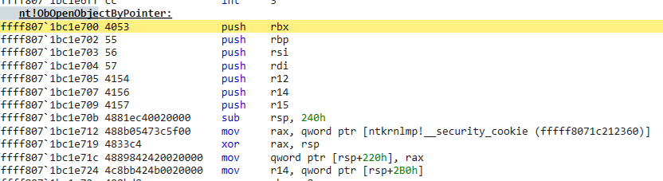

```C
#define KERNEL      0
#define USER        1

NTSTATUS ObOpenObjectByPointer(
  [in]           PVOID           Object,
  [in]           ULONG           HandleAttributes,
  [in, optional] PACCESS_STATE   PassedAccessState,
  [in]           ACCESS_MASK     DesiredAccess,
  [in, optional] POBJECT_TYPE    ObjectType,
  [in]           KPROCESSOR_MODE AccessMode,
  [out]          PHANDLE         Handle
);
```
ntkrnlmp!ObOpenObjectByPointer 브레이크를 건 다음 6번째 인자를 0으로 변경한다.

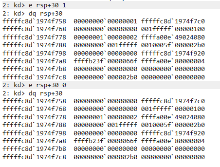

OpenProcess 다음코드 진행 후 결과 확인

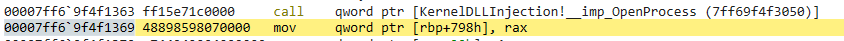
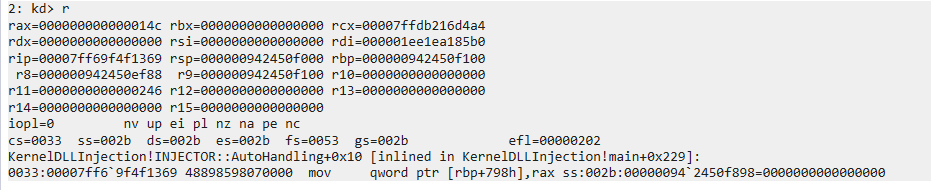

rax 값의 14c라는 정상 결과 값이 리턴되는 것을 확인 할 수 있다.

## CreateRemoteThreadEx
CreateRemoteThreadEx는 내부적으로 NtCreateThreadEx를 호출한다.

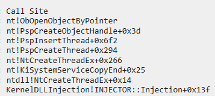

NtCreateThreadEx 또한 ObObjectByPointer를 호출하여 프로세스에 대한 핸들 값을 얻어간다.

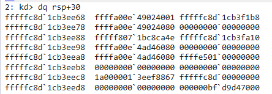
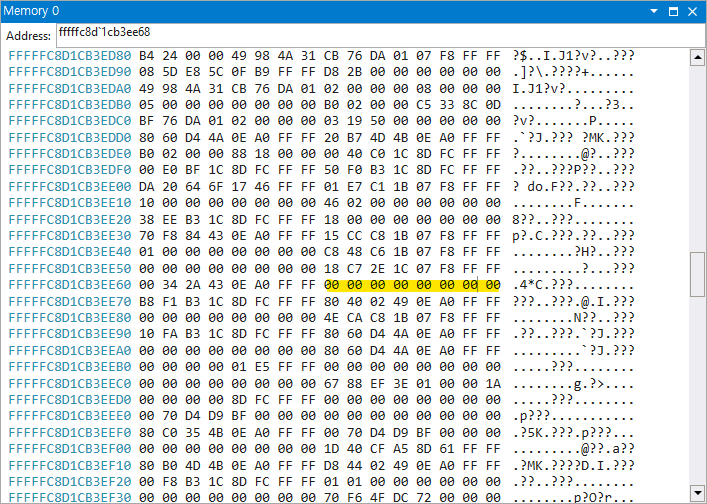

위와 동일하게 RSP+30 값을 0으로 만들어준다.

# 확인

프로세스 컨테스트를 services.exe로 변경

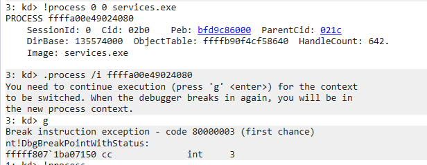

PEB 구조체를 확인하여 로드된 모듈을 확인한다.

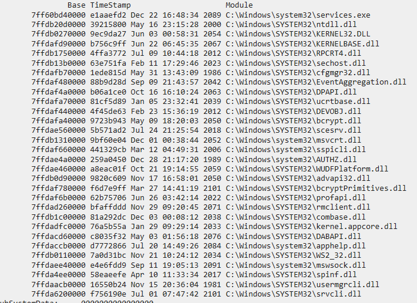
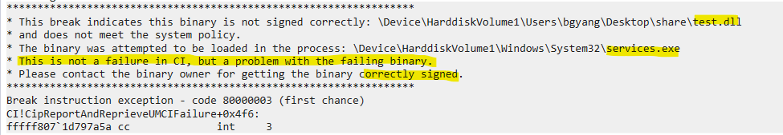

아쉽게도 DLL의 디지털 서명이 없어서 신뢰할 수 없는 파일로 로드가 안된다고 한다.  
Injection 자체는 성공하였으나, 인증에 문제가 있다.  
관련하여 찾아 봤으나 신뢰가능한 인증서를 발급받아, 코드 서명을 해서 DLL 로드를 하거나 보안정책을 변경해야 된다고 한다.

이 이상은 시간이 너무 오래걸렸던 관계로 여기까지 알아보고 나중에 다시알아보자...